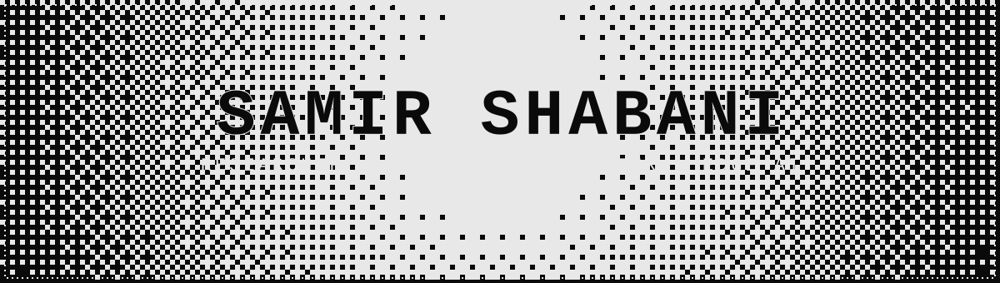

<!-- Dithered Hero -->

  

  
  

    
    
    
    
  

### About Me

Hi, I'm **Samir Shabani** - a Computer Science graduate from **South East European University (SEEU)**, Tetovo, North Macedonia, and a **Researcher & Full-Stack Engineer** at the **Max van der Stoel Institute**.

I build **intelligent edge systems**: deep-learning and federated-learning pipelines, GPU-accelerated digital twins, and cloud-native IoT infrastructure that runs on constrained hardware (Raspberry Pi, ESP32, NVIDIA GPUs). My work spans **air-quality modeling, RF network optimization, and multi-tenant web platforms**.

**> recent highlights:**
- **ICAMES 2026** - Most Applicable Project Award (capstone, Boğaziçi University)
- **Williams & May Global Innovation Challenge 2025** - Winner
- **GPU-Accelerated Digital Twin** - ~50× speedup in RF planning simulations
- **Cloud-Native IoT Pipeline** - 1,966 msg/s at 98.3% efficiency on a 5-node Pi cluster

### Experience

**Full-Stack Engineer & Lead Developer** - Max van der Stoel Institute (ChallengeEU Project) · *Feb 2026 – Present*
- Sole developer of a multi-tenant platform for a university consortium (~90,000 potential users).
- Backend in **Django 5.x / DRF** with **SAML2** federated identity across partner universities; **Celery + Redis** async processing.
- Production hardening: role-based access control, API rate-limiting, and a **Pytest** suite.

**Research Intern** - Max van der Stoel Institute, SEEU · *Mar 2025 – Jun 2025*
- Built a distributed **LoRaWAN** testbed to validate air-quality dispersion models.
- Developed deep-learning forecasting pipelines (**CNN–BiGRU**), including federated-learning variants.

### Publications & Preprints

- **"GPU-Accelerated LoRaWAN Gateway Placement via NSGA-II."** *Under review, ACM MSWIM 2026.* GPU Monte-Carlo RF simulation (~50× speedup vs. CPU); multi-objective coverage/spreading-factor optimization.
- **"Cloud-Native IoT Streaming and Storage on Low-Power Edge Clusters."** *Manuscript in preparation.* Production **K3s** pipeline on Raspberry Pi; 1,966 msg/s at 98.3% efficiency across 184 benchmark runs.

### Featured Projects

<table>
  <tr>
    <td width="50%">
      <h3><a href="https://github.com/Sam1rShaban1/rf-planner">⚡ RF Planner</a></h3>
      
GPU-accelerated RF coverage planning - a digital twin of Tetovo with 10⁸ path-loss calculations offloaded to an NVIDIA P100 via CuPy, optimized with NSGA-II.

      
<code>Python</code> <code>CuPy</code> <code>CUDA</code> <code>NSGA-II</code>

    </td>
    <td width="50%">
      <h3><a href="https://github.com/Sam1rShaban1/k3s-iot-stack">📡 k3s-iot-stack</a></h3>
      
GitOps-managed 5-node Raspberry Pi cluster: MQTT → NATS JetStream → VictoriaMetrics with full Prometheus/Grafana/Loki/Tempo observability.

      
<code>K3s</code> <code>ArgoCD</code> <code>EMQX</code> <code>Ansible</code>

    </td>
  </tr>
  <tr>
    <td width="50%">
      <h3><a href="https://github.com/Sam1rShaban1/Air-Quality-ML">🌫️ Air-Quality ML</a></h3>
      
Hybrid WOA-CNN-BiLSTM-AM model for PM2.5 forecasting with swarm-based hyperparameter tuning; R = 0.87 across 234 engineered features.

      
<code>TensorFlow</code> <code>Whale Optimization</code> <code>Attention</code>

    </td>
    <td width="50%">
      <h3><a href="https://github.com/Sam1rShaban1/Unocho">🌍 Unocho</a></h3>
      
Humanitarian funding-gap dashboard built at the ETH Zurich Datathon 2026 - interactive geographic visualization of funding shortfalls (OCHA data).

      
<code>React</code> <code>TypeScript</code> <code>Mapbox</code>

    </td>
  </tr>
  <tr>
    <td width="50%">
      <h3><a href="https://github.com/ChallengeEU/WP2CatalogueRefactor">🎓 ChallengeEU Catalogue</a></h3>
      
Multi-tenant consortium platform (Django/DRF + SAML2) serving a university network - the production system I lead as sole developer.

      
<code>Django</code> <code>DRF</code> <code>SAML2</code> <code>PostgreSQL</code>

    </td>
    <td width="50%">
      <h3><a href="https://github.com/Sam1rShaban1/vellum">📝 Vellum</a></h3>
      
Recent document-revalidation product (Python backend + TypeScript frontend) with structured editing and automated scoring.

      
<code>Python</code> <code>TypeScript</code> <code>React</code>

    </td>
  </tr>
</table>

### Where I've Contributed

I'm a member of the **[ChallengeEU](https://github.com/ChallengeEU)** and **[we-create-1](https://github.com/we-create-1)** organizations. Beyond my own repos, I've opened merged and open PRs across the ecosystem:

- **[menansali/rf-planner](https://github.com/menansali/rf-planner)** - link-budget fixes & OSM/antenna tooling (merged)
- **[NawfalMotii79/PLFM_RADAR](https://github.com/NawfalMotii79/PLFM_RADAR)** - GUI redesign (open)
- **[sivakumar-mahalingam/fastmrz](https://github.com/sivakumar-mahalingam/fastmrz)** - documentation (open)
- **[awesomedata/awesome-public-datasets](https://github.com/awesomedata/awesome-public-datasets)** - dataset link fix (open)
- **[besarism/restaurant-menu-api](https://github.com/besarism/restaurant-menu-api)** - dashboard decoupling & order-tracking features (merged)

### Technical Skills

  <table border="0">
    <tr>
      <td align="center" width="30%">
        <b>Artificial Intelligence</b>  
        
          
        <i>Deep Learning, Federated Learning, Time-Series & Spatial Modeling, LLM/Agent tooling.</i>
      </td>
      <td align="center" width="30%">
        <b>IoT & Hardware</b>  
        
          
        <i>LoRaWAN, ESP32, Raspberry Pi, GPU Computing (CUDA/CuPy).</i>
      </td>
      <td align="center" width="30%">
        <b>Cloud & DevOps</b>  
        
          
        <i>K3s/Kubernetes, ArgoCD/GitOps, Ansible, Prometheus, Grafana.</i>
      </td>
    </tr>
  </table>

**Languages:** Python · C++ · C# · TypeScript · SQL · Bash
**Web & Data:** Django 5.x · DRF · React · PostgreSQL · Redis · SAML2

### GitHub Analytics

   
  

### Education & Certifications

**Bachelor of Science in Computer Science**  
South East European University (SEEU) | Tetovo, North Macedonia  
GPA: 8.73/10.0 (246 ECTS) | Oct 2022 – Jul 2026 · Capstone grade 10/10

**Certifications:**
- Oracle Cloud Infrastructure GenAI Professional
- Unity Certified Programmer
- IBM Linux Shell Scripting

### Awards & International Programs

- **ICAMES 2026** - Most Applicable Project (capstone), Boğaziçi University · Winner
- **Williams & May Global Innovation Challenge 2025** - Winner (Technology Stream)
- **Erasmus+ BIP:** Agentic AI Solutions for Sustainable Innovation, Babeș-Bolyai University (UBB Cluj), Romania - Jun 2026
- **Erasmus+ BIP:** Industrial Robotics in Practice, Hochschule Offenburg, Germany (3 ECTS) - Mar 2026

### Let's Connect

I'm always interested in collaborating on research, open-source, and full-time opportunities in **AI/ML, IoT, GPU Computing, Distributed Systems, and Edge AI**.

- 💼 Open to research collaborations and full-time roles
- 🔬 Interested in: Edge AI, air-quality modeling, RF optimization, cloud-native systems
- 📧 shabani.samir12@gmail.com · [LinkedIn](https://linkedin.com/in/samir-shabani)
